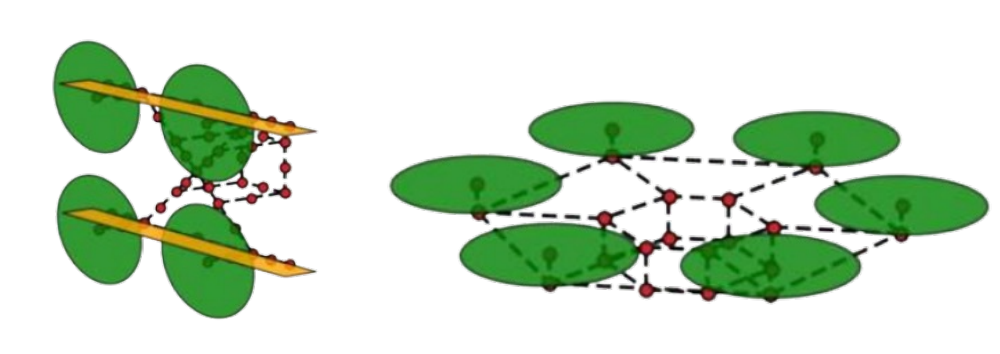
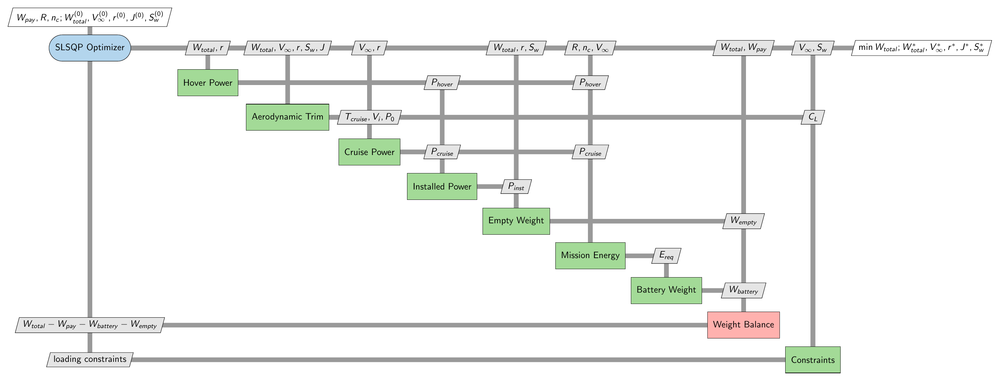
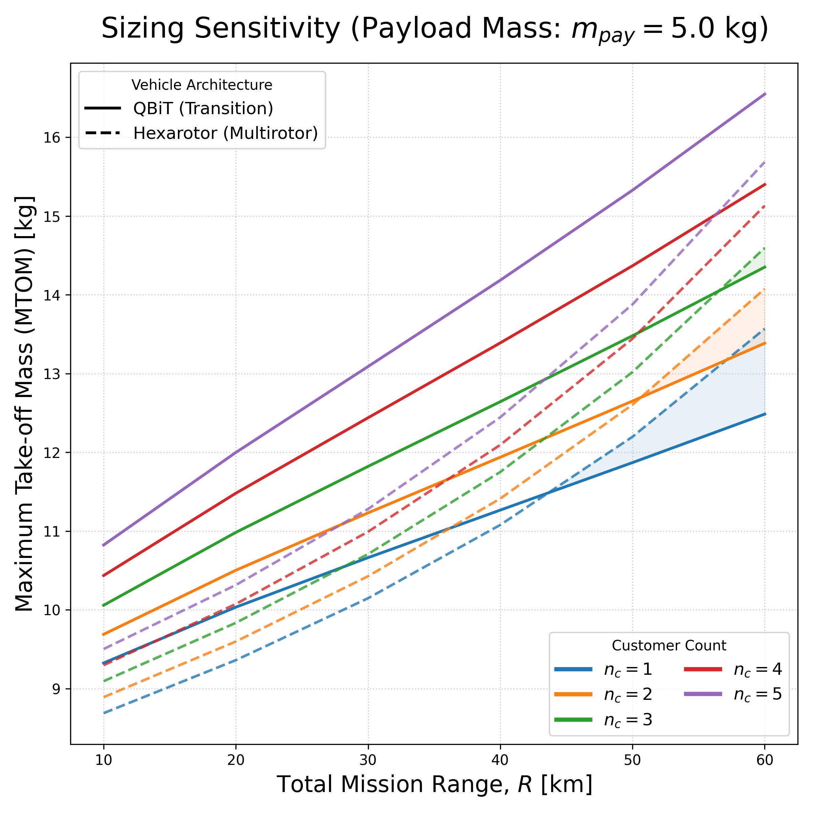

# QBiT and Hexarotor Sizing Optimization

Advanced Air Mobility (AAM) includes electric, often autonomous aircraft for applications such as package logistics, inspection, emergency response, and passenger transport. Vertical take-off and landing UAVs are especially useful where compact launch and recovery are needed.

This repository is an [OpenMDAO](https://openmdao.org/)-based multidisciplinary design optimization (MDO) model for conceptual eVTOL UAV sizing [[1]](#ref-1) [[2]](#ref-2). It minimizes take-off mass (MTOM) for a chosen payload, total mission range, and number of mission stops. The sizing formulation follows Kaneko and Martins [[3]](#ref-3) and Govindarajan and Sridharan [[4]](#ref-4).

The repository contains two vehicle architectures:

- **Hexarotor**: a six-rotor multirotor designed for efficient hover and short-range missions.
- **QBiT**: a quadrotor biplane tail-sitter that uses wings in cruise and is suited to longer-range missions.



*Figure 1. Hexarotor and QBiT concepts, adapted from Govindarajan and Sridharan [[4]](#ref-4).*

## Model overview

For both architectures, the optimizer varies the total weight, cruise speed, rotor radius, and advance ratio. The QBiT model also varies wing area. The model combines:

- hover power and cruise aerodynamic trim
- cruise and installed power
- mission energy and battery weight
- empty-weight estimation and total-weight balance
- disk and blade loading constraints

The QBiT model additionally applies a cruise lift-coefficient constraint.

## XDSM diagrams

The Extended Design Structure Matrix (XDSM) [[5]](#ref-5) shows the data flow between the optimizer, component models, weight balance, and constraints. The red weight-balance block returns the mass residual to the optimizer, which enforces it as an equality constraint.

### QBiT



### Hexarotor


## Setup

```bash
python -m venv .venv
source .venv/bin/activate
pip install -r requirements.txt
```

Generating the XDSM PDFs additionally requires a local LaTeX installation such as MacTeX or TeX Live.

## Usage

Run the default sizing optimizations from the repository root:

```bash
python sizing_openmdao/run_qbit.py
python sizing_openmdao/run_hexarotor.py
```

Change `PAYLOAD_KG`, `RANGE_M`, and `N_C` at the top of either runner script to evaluate another mission.

Regenerate the XDSM diagrams:

```bash
python xdsm/xdsm.py
pdftoppm -png -r 200 -singlefile xdsm/qbit_xdsm.pdf xdsm/qbit_xdsm
pdftoppm -png -r 200 -singlefile xdsm/hexarotor_xdsm.pdf xdsm/hexarotor_xdsm
```

## Sensitivity analysis

The 5 kg payload sweep compares MTOM across total mission ranges from 10 to 60 km and one to five customers. Solid lines show QBiT and dashed lines show the hexarotor; the lower line is the lighter, favorable architecture.

<p align="center">
	
</p>

For one, two, and three customers, the QBiT becomes lighter at total ranges of about 44 km, 51 km, and 57 km, respectively. For four and five customers, the hexarotor remains lighter throughout the plotted range.

## Repository structure

```text
sizing_openmdao/
	run_qbit.py                 # QBiT optimization runner
	run_hexarotor.py            # Hexarotor optimization runner
	qbit/                       # QBiT constants, components, groups, and model
	hexarotor/                  # Hexarotor constants, components, groups, and model
	sensitivity_analysis/       # Range and customer-count sensitivity studies
xdsm/                         # XDSM generator and rendered diagrams
requirements.txt              # Python dependencies
```

## References

<a id="ref-1"></a>[1] Gray, J. S., Hwang, J. T., Martins, J. R. R. A., Moore, K. T., and Naylor, B. A., 2019. *OpenMDAO: An Open-Source Framework for Multidisciplinary Design, Analysis, and Optimization*. Structural and Multidisciplinary Optimization, 59, 1075-1104. [https://doi.org/10.1007/s00158-019-02211-z](https://doi.org/10.1007/s00158-019-02211-z)

<a id="ref-2"></a>[2] Martins, J. R. R. A., and Lambe, A. B., 2013. *Multidisciplinary Design Optimization: A Survey of Architectures*. AIAA Journal, 51, 2049-2075. [https://doi.org/10.2514/1.J051895](https://doi.org/10.2514/1.J051895)

<a id="ref-3"></a>[3] Kaneko, S., and Martins, J. R. R. A., 2023. *Fleet Design Optimization of Package Delivery Unmanned Aerial Vehicles Considering Operations*. Journal of Aircraft, 60, 1061-1077. [https://doi.org/10.2514/1.C036921](https://doi.org/10.2514/1.C036921)

<a id="ref-4"></a>[4] Govindarajan, B., and Sridharan, A., 2020. *Conceptual Sizing of Vertical Lift Package Delivery Platforms*. Journal of Aircraft, 57, 1170-1188. [https://doi.org/10.2514/1.C035805](https://doi.org/10.2514/1.C035805)

<a id="ref-5"></a>[5] Lambe, A. B., and Martins, J. R. R. A., 2012. *Extensions to the Design Structure Matrix for the Description of Multidisciplinary Design, Analysis, and Optimization Processes*. Structural and Multidisciplinary Optimization, 46, 273-284. [https://doi.org/10.1007/s00158-012-0763-y](https://doi.org/10.1007/s00158-012-0763-y)